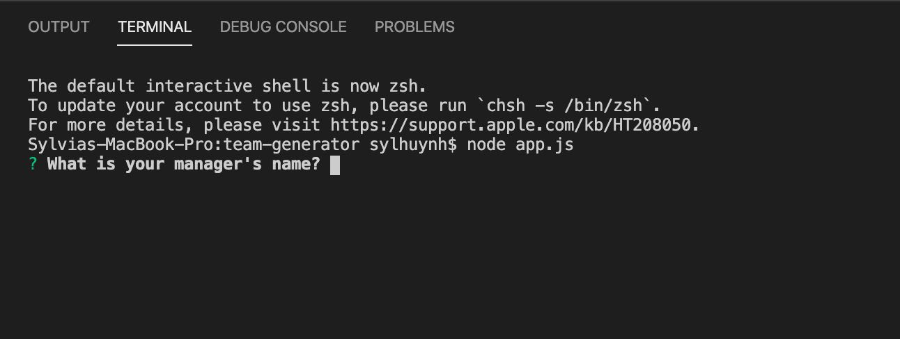
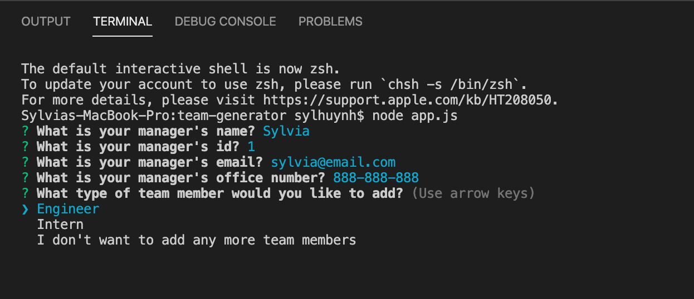
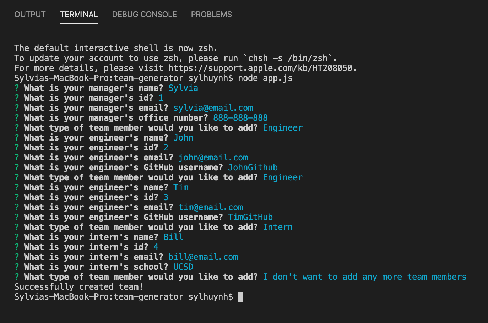
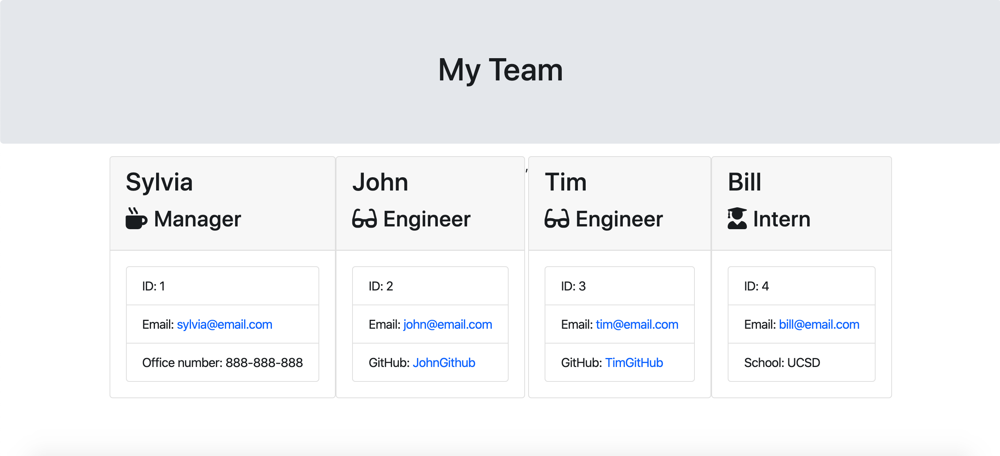

# Team Generator

## Description 
A software engineering team generator command line application that will create an HTML file that displays a nicely formatted team roster based on the information provided by the user

## Table of contents
* [Installation](#installation)
* [Usage](#usage)
* [Contributing](#contributing)
* [Tests](#tests)
* [Questions](#questions)

## Installation
To install necessary dependencies, run the following command:

npm install 

## Usage

When you first run the app, you will be prompted with a series of questions in regards to the manager's information

Once you have finished inputing all the information, you will be asked whether or not you would like to add a member to your team

There will be specific questions related to the employee class that you choose. When you have added a team member, you will be prompted once more on whether to continue adding to your team or not. If you choose not to, the app will alert you that you have sucessfully created your team

When you have finished creating your team, there will be a generated HTML file for you to easily access your team members' information

## Contributing 
If you would like to make changes please include a description and images of the feature with a pull request

## Tests
To run tests, run the following command:

npm run test

## Questions

If you have any questions about the repo, open an issue or contact  directly at sylhuynh76@gmail.com

